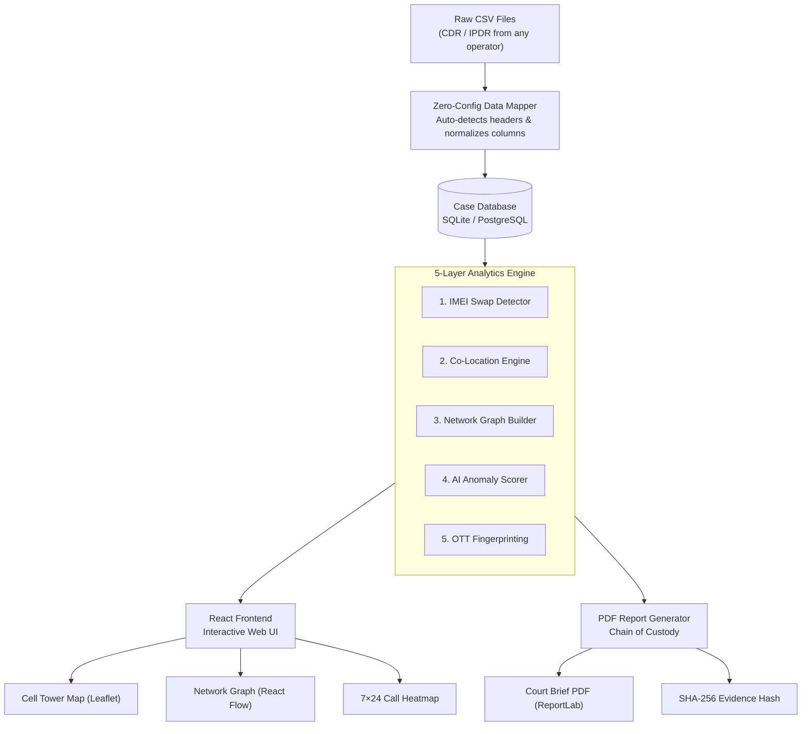
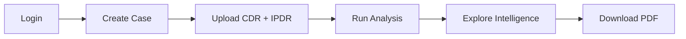

############### TRACE

### Telecom Record Analysis for Criminal Examination

**Prakasham District Police · Andhra Pradesh, India**

*A criminal intelligence platform that turns raw telecom data into actionable investigative evidence.*

<br />


<br />

[](https://fastapi.tiangolo.com/)
[](https://react.dev/)
[](https://www.docker.com/)
[](https://www.sqlite.org/)

</div>

---

## What is TRACE?

TRACE is a **web-based criminal intelligence workbench** built for district Cyber Cell investigators. It takes raw **Call Detail Records (CDR)** and **Internet Protocol Detail Records (IPDR)** — exactly as received from telecom operators — and automatically extracts intelligence that would otherwise take days of manual work.

No templates. No formatting. No Excel macros. Just upload and analyze.

### What TRACE Does Automatically

| # | Capability | What the Investigator Sees |
|:--|:-----------|:--------------------------|
| 1 | **Zero-Config Data Ingestion** | Upload raw CSVs from BSNL, Jio, Airtel, or Vi — TRACE maps the columns automatically |
| 2 | **IMEI Swap Detection** | Exact time, date, and cell tower where a suspect switched to a new handset |
| 3 | **Co-Location Detection** | When two or more suspects were at the same cell tower within a configurable time window |
| 4 | **Criminal Network Graph** | Visual map of who called whom — suspects, handlers, and shared contacts |
| 5 | **OTT App Fingerprinting** | WhatsApp, Telegram, and Signal usage detected from IPDR data patterns |
| 6 | **AI Anomaly Scoring** | A 0–100 risk score per suspect with a point-by-point breakdown |
| 7 | **Court-Ready PDF Reports** | Tamper-proof PDF with SHA-256 file hash — Section 65B IE Act compliant |

---

## Why TRACE is Different

| Area | Legacy Methods | TRACE |
|:-----|:---------------|:------|
| **Data Upload** | Fails if operator headers change even slightly | Auto-detects and maps native headers from all operators |
| **Device Evasion** | Spotted only by manually scanning thousands of rows | Automatically flags IMEI swaps with timestamp and tower |
| **Suspect Meetings** | Manual cross-referencing of timestamps in Excel | Geospatial engine detects co-location within minutes |
| **Relationships** | Investigators mentally map who knows whom | Interactive network graph built from actual call data |
| **Encrypted Apps** | Completely invisible to investigators | Detected via IPDR session patterns (size, timing, endpoints) |
| **AI Scoring** | Static risk categories with no explanation | Explainable score: each point justified with call evidence |
| **Evidence** | Manual screenshots pasted into Word documents | PDF with embedded SHA-256 hash for Chain of Custody |
| **Deployment** | Expensive servers or cloud subscriptions | One command on any workstation — fully offline |

---

## Platform Screenshots

### Login Portal
> Investigators authenticate with a Credential ID and passphrase. All sessions are JWT-secured.


---

### Case Management Dashboard
> Create and manage investigation cases. View suspect counts and active alerts per case.


---

### Case Detail View
> The main investigation workspace. Tabs for suspects, co-location events, shared contacts, and network graph.


---

### Geospatial Cell Tower Map
> Every CDR record plotted on an interactive map. Trace suspect movement. Spot meeting locations visually.


---

### Criminal Network Graph
> Force-directed graph of suspects and their contacts. Red nodes = high-risk handlers. Edge thickness = call volume.


---

### Suspect Deep-Dive Profile
> Full suspect profile: 7×24 hourly heatmap, IMEI swap alerts, OTT usage, co-location events, and PDF download.


---

### API Documentation (Swagger UI)
> Every feature exposed as a documented REST endpoint. Integrations and automation-ready.


---

## System Architecture



---

## How the Analytics Works

### 1. IMEI Swap Detection

Every CDR row has a phone number (MSISDN) and a handset ID (IMEI). TRACE sorts all records by time and flags any row where the IMEI changes — capturing exactly when and where the suspect switched devices.

```
CDR Row 1: MSISDN 9912345678 | IMEI: 354812XXXXXX | Tower: Chirala North | 01-Jan 10:32
CDR Row 2: MSISDN 9912345678 | IMEI: 490512XXXXXX | Tower: Chirala North | 03-Jan 14:07
                                       ↑ DIFFERENT — IMEI SWAP FLAGGED ↑
```

---

### 2. Co-Location Detection

TRACE compares the call records of all suspects in a case. When two or more suspects connect to the same cell tower within a configurable time window (default: 30 minutes), a meeting event is recorded.

```
Suspect A → Tower: Chirala_Town_BTS04 → 07-Jan 13:45
Suspect B → Tower: Chirala_Town_BTS04 → 07-Jan 14:10
                   Same tower, 25 minutes apart → MEETING DETECTED
```

---

### 3. AI Anomaly Scoring

Each suspect receives a 0–100 risk score based on five behavioural signals:

| Signal | What it Detects |
|:-------|:----------------|
| Night Calls (23:00–05:00) | Unusual communication hours |
| Silence Gaps (>24 hrs) | Deliberate blackout periods |
| IMEI Swap Count | Device evasion attempts |
| Co-Location Events | Physical meetings with other suspects |
| OTT App Volume Spikes | Encrypted communication bursts |

**Risk Bands:**

| Score | Level | Recommended Action |
|:------|:------|:-------------------|
| 0 – 30 | Low | Routine monitoring |
| 31 – 60 | Medium | Elevated investigation |
| 61 – 80 | High | Priority surveillance |
| 81 – 100 | Critical | Immediate escalation |

---

## Technology Stack

### Backend
| Technology | Role |
|:-----------|:-----|
| **FastAPI** (Python 3.11) | REST API framework |
| **SQLAlchemy** + SQLite / PostgreSQL | Database ORM and storage |
| **pandas** | CSV ingestion and column mapping |
| **NetworkX** | Suspect graph construction |
| **scikit-learn** (IsolationForest) | AI anomaly scoring |
| **ReportLab** | Court-ready PDF generation |
| **JWT** | Investigator authentication |

### Frontend
| Technology | Role |
|:-----------|:-----|
| **React 18** + TypeScript | Web application framework |
| **Vite** | Fast build and dev server |
| **Tailwind CSS** | UI styling |
| **React-Leaflet** | Interactive cell tower maps |
| **React Flow** | Suspect network graph |
| **Recharts** | Heatmaps and call charts |

### Infrastructure
| Technology | Role |
|:-----------|:-----|
| **Docker Compose** | One-command deployment |
| **Uvicorn** | ASGI server for FastAPI |
| **Swagger UI** | Auto-generated API docs |

---

## Quick Start

### Option A — Docker (Recommended)

```bash
git clone https://github.com/hydra-eng/trace.git
cd trace
docker-compose up --build
```

- Frontend: [http://localhost:5173](http://localhost:5173)
- API Docs: [http://localhost:8000/docs](http://localhost:8000/docs)

---

### Option B — Manual Setup

**Backend:**
```bash
cd trace-backend
pip install -r requirements.txt
python -m uvicorn main:app --reload --port 8000
```

**Frontend:**
```bash
cd trace-frontend
npm install
npm run dev
```

**Default Login Credentials:**
```
Username : investigator
Password : PrakasamPolice_2026!
```

---

## Demo Walkthrough (5 Minutes)

A step-by-step script to demonstrate TRACE to hackathon judges.



**Step 1 — Login**
Enter `investigator` / `PrakasamPolice_2026!` to open the investigator dashboard.

**Step 2 — Create a Case**
Click **New Case** → name it `Prakasam Gang Robbery Case` → Save.

**Step 3 — Upload Demo Data**
Go to **Upload Records** and add the files from the `demo-data/` folder:

| Suspect | CDR | IPDR |
|:--------|:----|:-----|
| Ravi Kumar (Suspect A) | `CDR_SuspectA.csv` | `IPDR_SuspectA.csv` |
| Suresh Babu (Suspect B) | `CDR_SuspectB.csv` | `IPDR_SuspectB.csv` |
| Ramaiah Yadav (Suspect C) | `CDR_SuspectC.csv` | — |

**Step 4 — Run Analysis**
Click **Run Analysis**. TRACE processes all records in seconds.

**Step 5 — Show the Intelligence**

- **Network Graph** → Red node `+91-9912000111` links all three suspects — a shared handler number proving coordination.
- **Suspect A Profile** → IMEI swap on Jan 3, co-location with Suspect B at Chirala Town on Jan 7, WhatsApp + Telegram OTT usage.
- **Shared Contacts Panel** → All numbers that appear in more than one suspect's records, ranked by frequency.

**Step 6 — Download Court Brief**
Click **Download Brief** → PDF includes the case header, anomaly breakdown, and SHA-256 hash of the uploaded source files.

---

## API Reference

Full docs available at [http://localhost:8000/docs](http://localhost:8000/docs)

| Method | Endpoint | Description |
|:-------|:---------|:------------|
| `POST` | `/auth/login` | Authenticate and receive JWT token |
| `GET` | `/cases/` | List all cases |
| `POST` | `/cases/` | Create a new case |
| `DELETE` | `/cases/{id}` | Delete a case |
| `POST` | `/upload/cdr` | Upload CDR file |
| `POST` | `/upload/ipdr` | Upload IPDR file |
| `POST` | `/analysis/run/{case_id}` | Run full analysis pipeline |
| `GET` | `/suspects/{case_id}` | Get all suspect profiles |
| `GET` | `/network/{case_id}` | Get network graph data |
| `GET` | `/report/pdf/{case_id}` | Download court-ready PDF |

---

## Project Structure

```
trace/
├── trace-backend/
│   ├── main.py                 # API entry point
│   ├── database.py             # Database models
│   ├── requirements.txt
│   └── routers/
│       ├── auth.py             # Login & JWT
│       ├── cases.py            # Case management
│       ├── upload.py           # CDR/IPDR ingestion & mapping
│       ├── analysis.py         # 5-layer analytics engine
│       ├── suspects.py         # Suspect profiles
│       ├── network.py          # Graph data
│       └── report.py           # PDF generation
│
├── trace-frontend/
│   └── src/
│       ├── pages/              # Route-level views
│       ├── components/         # Reusable UI components
│       ├── hooks/              # React hooks
│       └── api/                # API client
│
├── demo-data/                  # Sample CDR/IPDR files
├── docs/assets/                # Screenshots
├── docker-compose.yml
└── README.md
```

---

## Roadmap

### v1.0 — Current Release

- [x] Zero-Config CDR/IPDR ingestion (BSNL, Jio, Airtel, Vi)
- [x] IMEI Swap Detection
- [x] Co-Location / Geospatial Convergence Engine
- [x] Criminal Network Graph
- [x] Interactive Cell Tower Map
- [x] OTT App Fingerprinting via IPDR
- [x] AI Anomaly Scoring (IsolationForest)
- [x] Court-Ready PDF with SHA-256 Chain of Custody

### v2.0 — Planned

- [ ] Real-Time Tower Feed Integration
- [ ] Cross-District Case Federation
- [ ] Automated FIR Draft Generation
- [ ] CCTNS / Dial 112 Integration

---

## Security & Compliance

> **RESTRICTED — FOR AUTHORIZED LAW ENFORCEMENT USE ONLY**

- PDF reports include a **SHA-256 hash** of uploaded source files — establishes Chain of Custody compliant with **Section 65B of the Indian Evidence Act**
- All sessions secured via **JWT tokens** with configurable expiry
- TRACE runs **fully offline** — no data leaves the investigator's workstation
- All upload and analysis operations are logged with timestamps
