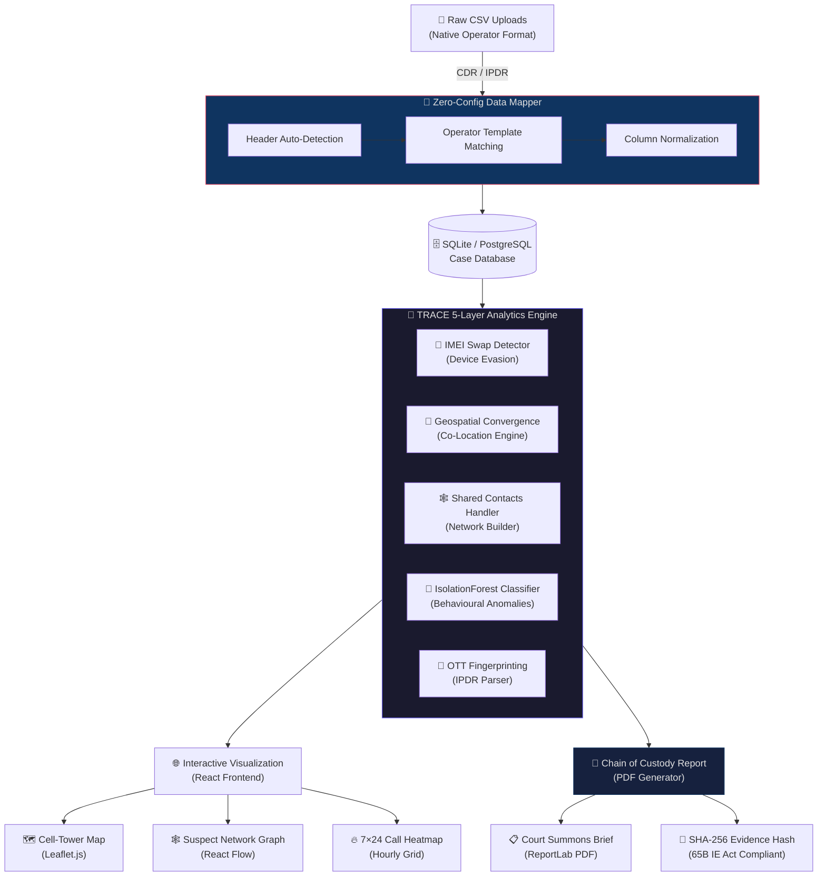
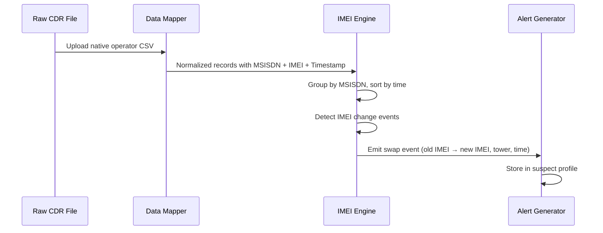
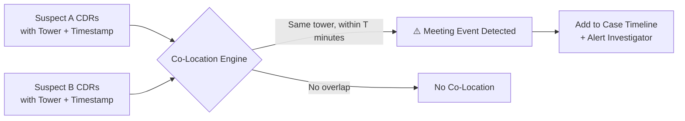
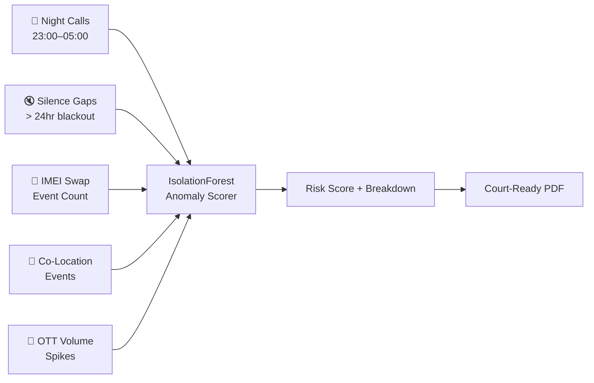
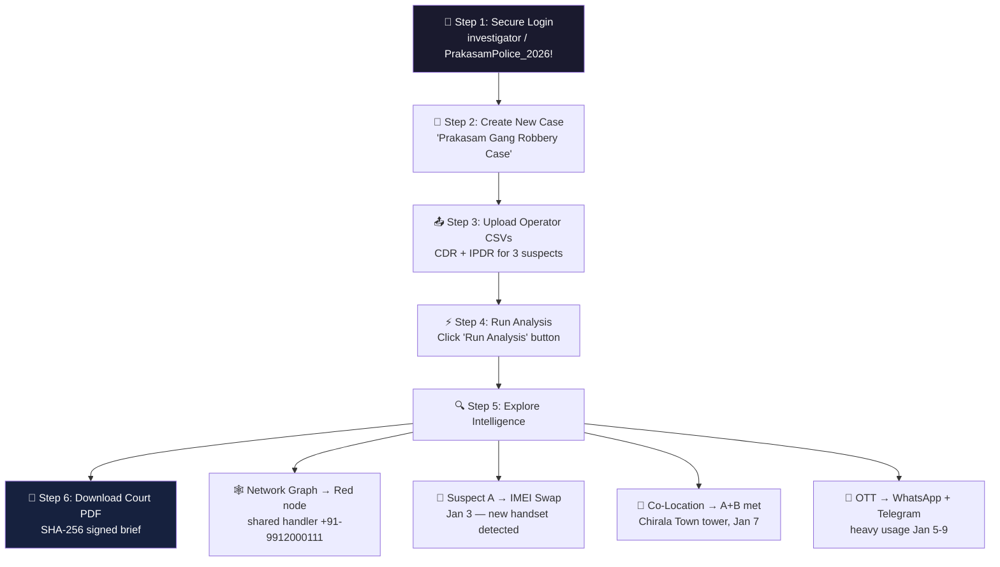

<div align="center">


<br /><br />


<br />

# 🕵️ TRACE
### **T**elecom **R**ecord **A**nalysis for **C**riminal **E**xamination

**Prakasham District Police · Andhra Pradesh**
*A Next-Generation Criminal Intelligence Platform for Cyber Cell Investigators*

---

[](https://fastapi.tiangolo.com/)
[](https://react.dev/)
[](https://www.sqlite.org/)
[](https://www.docker.com/)

</div>

---

## 📌 Table of Contents

1. [What is TRACE?](#-what-is-trace)
2. [Why TRACE is Different](#-why-trace-is-different--the-competitive-edge)
3. [Platform Gallery](#-platform-gallery)
4. [System Architecture](#️-system-architecture--data-flow)
5. [Analytics Engine Deep-Dive](#-analytics-engine-deep-dive)
6. [Technology Stack](#️-technology-stack)
7. [Quick Start](#-quick-start)
8. [Hackathon Walkthrough](#-guided-hackathon-walkthrough)
9. [API Reference](#-api-reference)
10. [Project Structure](#-project-structure)
11. [Roadmap](#-roadmap)

---

## 🔍 What is TRACE?

> **TRACE** is an **open-source criminal intelligence workbench** built for district-level Cyber Cell investigators. It processes raw **Call Detail Records (CDR)** and **Internet Protocol Detail Records (IPDR)** directly from telecom operators — in their native, unmodified format — and automatically surfaces:

- 📡 **Device Evasion Events** — Suspects swapping SIM cards into new handsets (IMEI Swapping)
- 📍 **Co-Location Meetings** — When two suspects are at the same cell tower sector within a configurable time window
- 🕸️ **Criminal Network Maps** — Interactive suspect-to-handler relationship graphs
- 🔐 **OTT App Fingerprinting** — Detecting WhatsApp, Telegram, Signal usage from IPDR data patterns
- 🤖 **AI Anomaly Scoring** — Isolation Forest ML model scoring suspicious behavioural patterns
- 📄 **Court-Ready PDF Briefs** — Section 65B Indian Evidence Act-compatible reports with SHA-256 Chain of Custody

**TRACE is not another Excel macro or closed-source blackbox.** It is a real-time, investigator-grade web platform built from the ground up for the realities of district policing in India.

---

## 🏆 Why TRACE is Different — The Competitive Edge

### Feature-by-Feature Comparison

| 🔍 Feature Area | ❌ Legacy Methods | ✅ TRACE Advantage |
|:---|:---|:---|
| **Data Ingestion** | Requires pre-formatted templates. Fails on minor header changes from operators | **Zero-Config Operator Mapping** — auto-detects and maps native raw CDR/IPDR headers from BSNL, Jio, Airtel & Vi |
| **IMEI / Device Tracking** | Manually cross-referencing thousands of rows in Excel | **Automatic IMEI Swap Detection** — flags exact timestamp, cell tower & handset where suspect changed device |
| **Co-Location Analysis** | Manual Excel timestamp matching — error-prone and slow | **Geospatial Convergence Engine** — auto-detects when suspects meet at the same tower sector within configurable time windows |
| **Suspect Network** | No visual network; investigators must mentally map relationships | **Live Interactive Network Graph** — React Flow powered, showing suspects, handlers, and communication clusters |
| **AI / Anomaly Detection** | Static rules or blackbox ratings with no explainability | **IsolationForest Behavioural Scorer** — point-by-point breakdown: night calls, OTT bursts, silence gaps, co-location events |
| **OTT / Encrypted Apps** | Invisible — no visibility into WhatsApp/Telegram usage | **IPDR OTT Fingerprinting** — detects app signatures from data session size, timing & endpoint patterns |
| **Geo-Visualization** | No maps; latitude/longitude stays as raw numbers | **Leaflet.js Cell-Tower Map** — interactive pin map of every call's tower location with suspect trails |
| **Evidence Reports** | Manual screenshots and Word documents — inadmissible without certification | **High-Fidelity PDF Briefs** — SHA-256 source-file hash, dynamic case header, Section 65B IE Act compliant |
| **Operator Support** | Vendor-locked to specific format | **Multi-Operator Native Format** — BSNL, Jio, Airtel, Vodafone-Idea templates auto-detected |
| **Deployment** | Expensive server procurement | **Docker Compose One-Command Deploy** — runs on a standard workstation, no cloud required |

### What Makes TRACE Unique at a Glance

```
┌─────────────────────────────────────────────────────────────────┐
│                    TRACE UNIQUE CAPABILITIES                    │
├─────────────────────────────┬───────────────────────────────────┤
│ Zero-Config Data Ingestion  │ No template prep. Native headers. │
│ IMEI Swap Auto-Detection    │ Device evasion flagged instantly   │
│ Co-Location Engine          │ Meeting detection with GPS sector  │
│ OTT Fingerprinting          │ Encrypted app usage from IPDR      │
│ Explainable AI Scoring      │ Point-by-point anomaly breakdown   │
│ SHA-256 Chain of Custody    │ Court-admissible evidence hashes   │
│ Multi-Operator Support      │ BSNL, Jio, Airtel, Vi — all native │
│ Open Source & Offline       │ No vendor lock-in, runs offline    │
└─────────────────────────────┴───────────────────────────────────┘
```

---

## 📸 Platform Gallery

### 🔒 1. Secure Boot & Authentication

> The platform initializes with a secure bootloader sequence, verifying investigator credentials before establishing an encrypted session.

<table>
<tr>
<td></td>
<td></td>
</tr>
<tr>
<td align="center"><em>⬅️ TRACE Bootloader Screen</em></td>
<td align="center"><em>Investigator Login Portal ➡️</em></td>
</tr>
</table>

---

### 🗂️ 2. Criminal Intelligence Dashboard

> Centralized case management hub. Create, monitor, and delete investigation case files. View live suspect counts, audit records, and alert summaries at a glance.


---

### 🔬 3. Case Detail & Investigation Hub

> Deep-dive into a specific case. View suspect relationships, behavioral timelines, and co-location events from a single unified interface.


---

### 🗺️ 4. Geospatial Cell Tower Mapping

> Every CDR record is plotted on an interactive Leaflet.js map. Investigators can visually trace suspect movement, identify home towers, and spot co-location convergence points.


---

### 🕸️ 5. Interactive Criminal Network Graph

> A React Flow powered, force-directed network graph shows relationships between suspects, their handlers, and shared contacts. Red nodes = high-risk coordinators. Thickness of edges = call frequency.


---

### 👤 6. Suspect Deep-Dive Profile

> Full analytical profile for every suspect: 7×24 hourly call heatmaps, IMEI swap alerts, OTT usage logs, co-location events, and a one-click court-ready PDF download.


---

### 📖 7. REST API — Live Documentation (Swagger UI)

> Every feature is API-first and fully documented. Field investigators and integrations can automate workflows via the RESTful API.


---

## ⚙️ System Architecture & Data Flow



---

## 🧠 Analytics Engine Deep-Dive

### Layer 1 — IMEI Swap Detection



> **How it works:** Every CDR row has an MSISDN (phone number) and IMEI (handset ID). The engine sorts all records chronologically and flags any row where the IMEI changes — capturing the exact time and cell tower where the swap occurred.

---

### Layer 2 — Co-Location / Geospatial Convergence



> **Time window is configurable.** Default is 30 minutes at the same BTS/sector. Results include the tower ID, GPS coordinates, and all suspects present at the convergence point.

---

### Layer 3 — OTT Fingerprinting (IPDR Analysis)

| App | Detection Method |
|:---|:---|
| **WhatsApp** | Data session to Meta/Facebook AS, session size 2–20KB bursts (message), continuous stream (call) |
| **Telegram** | Sessions to Telegram MTProto IPs, distinctive port patterns |
| **Signal** | Sessions to Signal Foundation IP ranges |
| **Generic Encrypted** | TLS sessions with no SNI + non-standard ports |

---

### Layer 4 — Behavioural Anomaly Scoring



**Score Bands:**

| Score Range | Risk Level | Action |
|:---|:---|:---|
| 0–30 | 🟢 Low | Routine monitoring |
| 31–60 | 🟡 Medium | Elevated investigation |
| 61–80 | 🟠 High | Priority surveillance |
| 81–100 | 🔴 Critical | Immediate escalation |

---

## 🛠️ Technology Stack

### Backend
| Component | Technology | Purpose |
|:---|:---|:---|
| API Framework | **FastAPI** (Python 3.11) | High-performance async REST API |
| ORM / DB | **SQLAlchemy** + **SQLite** / **PostgreSQL** | Relational case storage |
| Data Wrangling | **pandas** | CSV ingestion, column mapping, analysis |
| Graph Analysis | **NetworkX** | Suspect relationship graph construction |
| ML / AI | **scikit-learn** (IsolationForest) | Anomaly scoring & outlier detection |
| PDF Engine | **ReportLab** | Court-ready report generation |
| Auth | JWT Tokens | Secure investigator session management |

### Frontend
| Component | Technology | Purpose |
|:---|:---|:---|
| Framework | **React 18** + **TypeScript** | Type-safe component architecture |
| Build Tool | **Vite** | Lightning-fast HMR development |
| UI Styling | **Tailwind CSS** | Utility-first dark theme design |
| Maps | **React-Leaflet** (Leaflet.js) | Interactive cell tower mapping |
| Network Graph | **React Flow** | Force-directed suspect network visualization |
| Charts | **Recharts** | 7×24 heatmaps, call frequency charts |

### Infrastructure
| Component | Technology |
|:---|:---|
| Containerization | **Docker** + **Docker Compose** |
| Development Server | **Uvicorn** (ASGI) |
| API Documentation | **Swagger UI** + **ReDoc** (auto-generated) |

---

## 🚀 Quick Start

### ⚡ Option A: Docker (Recommended — Single Command)

Ensure **Docker Desktop** is running, then:

```bash
# 1. Clone the repository
git clone https://github.com/hydra-eng/trace.git
cd trace

# 2. Launch everything
docker-compose up --build

# 3. Open in browser
#    Frontend Portal:  http://localhost:5173
#    API + Swagger UI: http://localhost:8000/docs
```

---

### 🔧 Option B: Manual Developer Setup

#### Step 1 — Backend

```bash
cd trace-backend

# Create a virtual environment (recommended)
python -m venv .venv
source .venv/bin/activate    # Linux/Mac
.venv\Scripts\activate       # Windows

# Install dependencies
pip install -r requirements.txt

# Start the API server
python -m uvicorn main:app --reload --port 8000
```

> API Docs available at: [http://localhost:8000/docs](http://localhost:8000/docs)

#### Step 2 — Frontend

```bash
cd trace-frontend

# Install Node dependencies
npm install

# Start development server
npm run dev
```

> Frontend available at: [http://localhost:5173](http://localhost:5173)

#### Step 3 — First Login

```
Credential ID  : investigator
Passphrase     : PrakasamPolice_2026!
```

---

## 🎯 Guided Hackathon Walkthrough

*Complete showcase in under 5 minutes for judges.*



### Step-by-Step Guide

**1. Authenticate**
Log in with Credential ID `investigator` and passphrase `PrakasamPolice_2026!`.

**2. Create a Case**
Click **New Case** → Enter `"Prakasam Gang Robbery Case"` → Save.

**3. Upload Demo Data**
Navigate to **Upload Records** and upload the sample CSVs from the `demo-data/` folder:

| Suspect | Name | CDR File | IPDR File |
|:---|:---|:---|:---|
| Suspect A | Ravi Kumar | `...CDR_SuspectA.csv` | `...IPDR_SuspectA.csv` |
| Suspect B | Suresh Babu | `...CDR_SuspectB.csv` | `...IPDR_SuspectB.csv` |
| Suspect C | Ramaiah Yadav | `...CDR_SuspectC.csv` | *(not available)* |

**4. Run Analysis**
Click **Run Analysis** — TRACE processes all records and builds full suspect profiles within seconds.

**5. Explore Intelligence**

- **Network Tab** → Point out the red node `+91-9912000111` — *"This shared handler number appeared in the call logs of all three suspects, establishing coordination."*
- **Shared Contacts Panel** → Show the list of shared handler numbers under the Suspects tab.
- **Suspect A Profile** → Demonstrate:
  - 🔄 **IMEI Swap alert** — SIM swapped to a new handset on Jan 3
  - 📍 **Co-Location** — Suspects A & B met at the Chirala Town tower on Jan 7
  - 🔐 **OTT Usage** — Heavy WhatsApp and Telegram data signatures detected

**6. Court-Ready Report**
Click **Download Brief** → Receive a tamper-proof PDF featuring dynamic case number headers, anomaly breakdowns, and the SHA-256 source-file hash block.

---

## 📡 API Reference

All endpoints are available and documented via Swagger UI at `/docs`.

### Core Endpoints

| Method | Endpoint | Description |
|:---|:---|:---|
| `POST` | `/auth/login` | Authenticate investigator → receive JWT |
| `GET` | `/cases/` | List all investigation cases |
| `POST` | `/cases/` | Create a new case |
| `DELETE` | `/cases/{id}` | Delete a case and all associated data |
| `POST` | `/upload/cdr` | Upload CDR CSV (native operator format) |
| `POST` | `/upload/ipdr` | Upload IPDR CSV (native operator format) |
| `POST` | `/analysis/run/{case_id}` | Trigger full 5-layer analysis pipeline |
| `GET` | `/report/pdf/{case_id}` | Generate and download court-ready PDF |
| `GET` | `/suspects/{case_id}` | Get all suspect profiles for a case |
| `GET` | `/network/{case_id}` | Get graph nodes/edges for network visualization |

---

## 📁 Project Structure

```
trace/
├── 📂 trace-backend/              # FastAPI Python Backend
│   ├── main.py                   # Application entry point
│   ├── database.py               # SQLAlchemy models & connection
│   ├── requirements.txt          # Python dependencies
│   └── 📂 routers/
│       ├── auth.py               # JWT authentication
│       ├── cases.py              # Case CRUD operations
│       ├── upload.py             # CDR/IPDR ingestion & mapping
│       ├── analysis.py           # 5-layer analytics engine
│       ├── suspects.py           # Suspect profile endpoints
│       ├── network.py            # Graph data endpoints
│       └── report.py            # PDF report generation
│
├── 📂 trace-frontend/             # React + TypeScript Frontend
│   ├── src/
│   │   ├── 📂 pages/             # Route-level page components
│   │   ├── 📂 components/        # Reusable UI components
│   │   ├── 📂 hooks/             # Custom React hooks
│   │   └── 📂 api/               # Axios API client functions
│   └── vite.config.ts
│
├── 📂 demo-data/                  # Sample CDR/IPDR files for demo
├── 📂 docs/assets/               # Platform screenshots
├── docker-compose.yml            # One-command deployment
└── README.md                     # This file
```

---

## 🗺️ Roadmap

| Phase | Feature | Status |
|:---|:---|:---|
| **v1.0** | CDR Upload + Zero-Config Operator Mapping | ✅ Complete |
| **v1.0** | IMEI Swap Detection | ✅ Complete |
| **v1.0** | Co-Location Engine | ✅ Complete |
| **v1.0** | Suspect Network Graph | ✅ Complete |
| **v1.0** | Cell Tower Map (Leaflet) | ✅ Complete |
| **v1.0** | OTT Fingerprinting via IPDR | ✅ Complete |
| **v1.0** | AI Anomaly Scoring (IsolationForest) | ✅ Complete |
| **v1.0** | Court-Ready PDF with SHA-256 | ✅ Complete |
| **v2.0** | Real-Time Tower Feed Integration | 🔜 Planned |
| **v2.0** | Cross-District Case Federation | 🔜 Planned |
| **v2.0** | Automated FIR Draft Generation | 🔜 Planned |
| **v2.0** | CCTNS / 112 Integration | 🔜 Planned |

---

## 🔐 Security & Compliance Notice

> **RESTRICTED — FOR AUTHORIZED LAW ENFORCEMENT USE ONLY**

- All generated PDF reports include a **SHA-256 hash** of the source CDR/IPDR files, establishing an unbroken Chain of Custody compliant with **Section 65B of the Indian Evidence Act**.
- Session authentication is enforced via **JWT tokens** with configurable expiry.
- No data is transmitted to any external cloud service. TRACE operates **fully offline** on the investigator's workstation.
- Access logs are maintained for all upload and analysis operations.

---

<div align="center">

**Built with ❤️ by the Prakasham District Cyber Cell**

*Empowering investigators with intelligence, not just data.*

---

*© 2026 Prakasham District Police, Andhra Pradesh. All rights reserved.*
*TRACE — Telecom Record Analysis for Criminal Examination*

</div>
