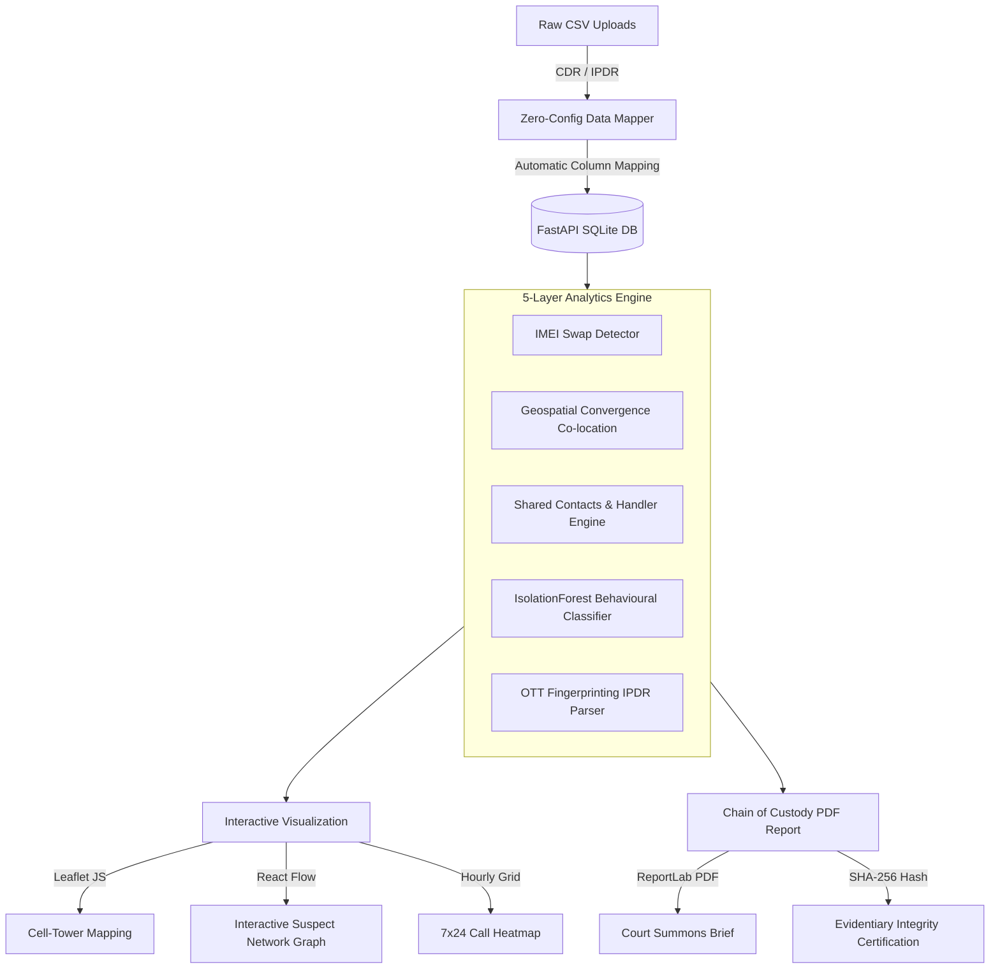

# <div align="center">🕵️‍♂️ TRACE</div>
## <div align="center">Telecom Record Analysis for Criminal Examination</div>

<div align="center">
  
  <br />
  <strong>Prakasham District Police &middot; Andhra Pradesh</strong>
  <br />
  <em>RESTRICTED &middot; FOR LAW ENFORCEMENT AND INVESTIGATION AGENCIES ONLY</em>
</div>

---

TRACE is a state-of-the-art criminal intelligence and suspect tracking platform designed to process raw Call Detail Records (CDR) and Internet Protocol Detail Records (IPDR) directly. It automatically extracts network nodes, identifies device evasions (IMEI swapping), pinpoints co-location meetings, scores behavioural anomalies, and detects encrypted OTT communication patterns.

---

## 📸 Platform Interface Gallery

### 1. Secure Node Authentication
*Bootloader screen verifying credentials and establishing an encrypted investigator session.*


### 2. Criminal Intelligence Dashboard
*Manage active case files, view suspect counts, audit records, and delete closed investigations.*


### 3. Investigation & Case Details
*Analyze co-location events, track movement, and inspect the unified suspect networks.*


### 4. Suspect Deep-Dive Profile
*Geospatial mapping of cell towers, 7×24 hourly heatmaps, encrypted app analysis, and court-ready PDF briefs.*


---

## 💡 Why TRACE is Different

Unlike standard excel-based macros and expensive closed-source telecom platforms, TRACE provides an open, modern, and high-fidelity analytical workbench tailored for district-level cyber cells.

| Feature Area | Legacy Methods | TRACE Advantage |
| :--- | :--- | :--- |
| **Data Ingestion** | Requires strict, pre-formatted templates. Fails on minor header modifications. | **Zero-Config Operator Mapping**: Automatically detects and maps native raw CDR/IPDR headers from BSNL, Jio, Airtel, and Vodafone-Idea. |
| **Evasion Detection** | Hard to spot handset changes without cross-referencing thousands of rows. | **Automatic IMEI Swapping**: Automatically flags the exact hour, timestamp, and location where a suspect swapped their SIM card into a new handset. |
| **Co-Location Events** | Manual matching of Excel timestamps to find overlaps. | **Geospatial Convergence Engine**: Auto-detects when two or more suspects meet at the same cell tower sector within a configurable time window. |
| **Explainable AI** | Blackbox threat ratings or generic high/medium categories. | **Dynamic Anomaly Scoring**: Provides a point-by-point breakdown (night calling, silences, OTT usage, co-location) for court-ready explainability. |
| **Court-Ready Reports** | Manual screenshotting and word document assembly. | **High-Fidelity PDF Generation**: Instantly compiles a tamper-proof PDF brief featuring SHA-256 hashes of source files for Chain of Custody (Section 65B IE Act compatible). |

---

## ⚙️ System Architecture & Data Flow



---

## 🛠️ Technology Stack

* **Backend API**: Python 3.11, FastAPI, SQLAlchemy, SQLite (Development) / PostgreSQL (Production)
* **Analysis Libraries**: `pandas` (ingestion/wrangling), `NetworkX` (graph nodes), `scikit-learn` (IsolationForest anomalies)
* **Evidentiary PDF Engine**: `reportlab`
* **Frontend Web Application**: React 18, TypeScript, Vite, Tailwind CSS
* **Geospatial & Networks**: Leaflet (via React-Leaflet), React Flow

---

## 🚀 Setting Up the Workstation

### Method A: Single Command Deploys (Recommended)
Ensure **Docker Desktop** is running on your workstation.

1. Clone or open the repository folder.
2. Spin up the containers:
   ```bash
   docker-compose up --build
   ```
3. Open your browser:
   * **TRACE Portal**: [http://localhost:5173](http://localhost:5173)
   * **API Docs & Swagger**: [http://localhost:8000/docs](http://localhost:8000/docs) (also shown below)
   

---

### Method B: Manual Developer Run

#### 1. Start backend server
```bash
cd trace-backend
pip install -r requirements.txt
python -m uvicorn main:app --reload --port 8000
```

#### 2. Start frontend dev server
```bash
cd trace-frontend
npm install
npm run dev
```

---

## 🎯 Guided Hackathon Walkthrough

Here is a 5-minute showcase script to demonstrate TRACE to hackathon judges:

1. **Secure Access**: Log in with Credential ID `investigator` and passphrase `PrakasamPolice_2026!`.
2. **Case Creation**: Click **New Case** and create `"Prakasam Gang Robbery Case"`.
3. **Upload Real Data**: Click **Upload Records** and select the operator CSV files in the `demo-data/` folder:
   * **Suspect A (Ravi Kumar)**: Upload `Prakasam_District_Operator_CDR_SuspectA...csv` and `Prakasam_District_Operator_IPDR_SuspectA...csv`.
   * **Suspect B (Suresh Babu)**: Upload `Prakasam_District_Operator_CDR_SuspectB...csv` and `Prakasam_District_Operator_IPDR_SuspectB...csv`.
   * **Suspect C (Ramaiah Yadav)**: Upload `Prakasam_District_Operator_CDR_SuspectC...csv` (Leave IPDR empty).
4. **Trigger Analytics**: Click **Run Analysis**. Within seconds, TRACE builds the suspect profiles.
5. **Demonstrate Intelligence**:
   * **Network Tab**: Point out the red node `+91-9912000111` — "This shared handler number appeared in the call logs of all three suspects, establishing coordination."
   * **Shared Contacts Panel**: Show the list of shared handler numbers directly under the Suspects tab.
   * **Suspect A Profile**: Click Suspect A and point out:
     - **IMEI Swap alert**: Sim swapped into a new handset on Jan 3.
     - **Co-Location**: Cross-analysis shows Suspect A and B met at the Chirala Town tower on Jan 7.
     - **OTT Usage**: Decrypted app signatures show heavy data usage over WhatsApp and Telegram.
6. **Evidentiary Hand-off**: Click **Download Brief** to download the court-ready PDF featuring dynamic case number headers, anomaly breakdowns, and the SHA-256 data hash block.
