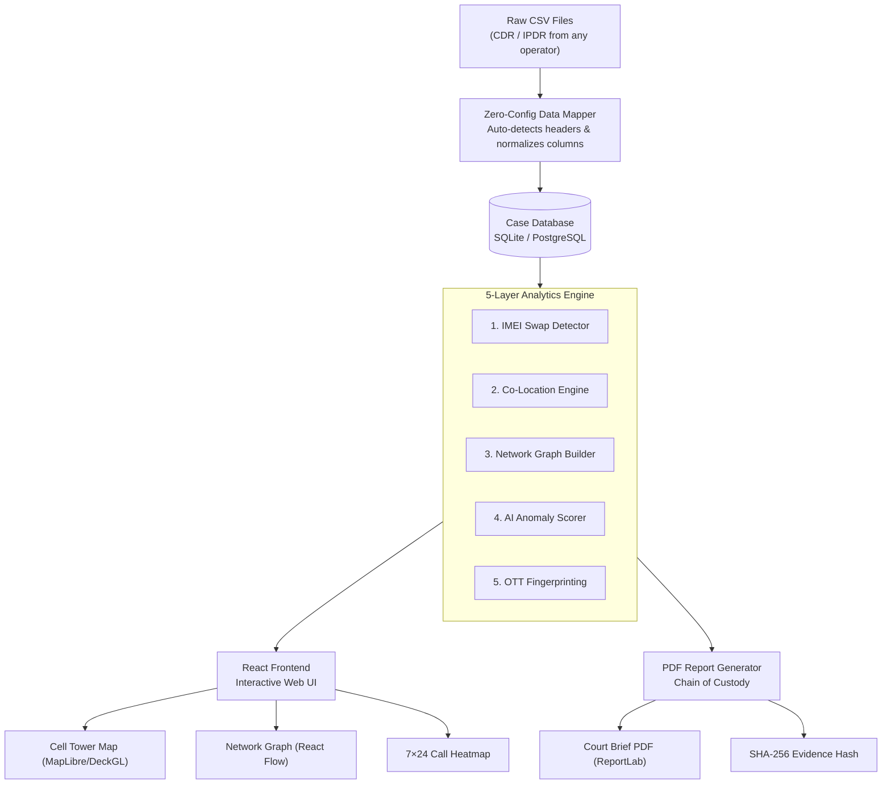
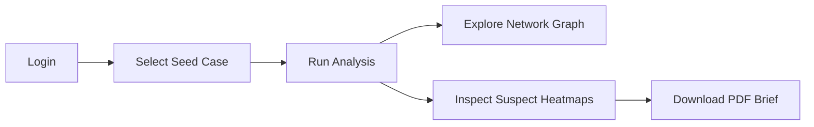

# TRACE
### Telecom Record Analysis for Criminal Examination

**Prakasham District Police · Andhra Pradesh, India**

*A high-performance criminal intelligence workbench that parses raw telecom data (CDR/IPDR) to trace device evasions, map co-locations, and reconstruct target networks.*

<br />

<div align="center">


<br />

[](https://fastapi.tiangolo.com/)
[](https://react.dev/)
[](https://www.docker.com/)
[](https://www.sqlite.org/)

</div>

---

## 🔍 What is TRACE?

TRACE is a **web-based criminal intelligence platform** built for district Cyber Cell investigators. It takes raw **Call Detail Records (CDR)** and **Internet Protocol Detail Records (IPDR)** — exactly as received from telecom operators — and automatically extracts intelligence that would otherwise take days of manual work.

> [!TIP]
> **No templates. No manual column matching. No Excel macros.** Simply upload raw CSV exports from BSNL, Jio, Airtel, or Vi, and TRACE does the rest.

### Core Analytics Stack

| # | Capability | What the Investigator Sees |
|:--|:-----------|:--------------------------|
| 1 | 📂 **Zero-Config Ingestion** | Drag-and-drop raw CSVs — TRACE maps the columns automatically using fuzzy keyword heuristics |
| 2 | 📱 **IMEI Swap Detection** | Exact time, date, and cell tower coordinates where a suspect swapped active SIM cards |
| 3 | 🤝 **Co-Location Engine** | Automatically highlights instances where multiple suspects converged at the same cell tower in a 30-min window |
| 4 | 🕸 **Network Graph** | Visual topology showing calls between suspects, handlers, and common contact nodes |
| 5 | 🔒 **OTT App Fingerprinting** | Recognizes WhatsApp, Telegram, and Signal secure sessions from raw IPDR traffic volume signatures |
| 6 | 🧠 **AI Anomaly Scoring** | A 0–100 risk score per suspect generated using an Isolation Forest outlier model, with full factor justifications |
| 7 | 📄 **65B IE Act PDF Brief** | Generates tamper-proof PDF suspect profile dossiers with embedded SHA-256 source file hashes |

---

## ⚡ Why TRACE is Different

| Area | Legacy Methods | TRACE |
|:-----|:---------------|:------|
| **Data Ingestion** | Fails if operator headers change even slightly | Auto-detects and maps native headers from all operators |
| **Device Evasion** | Spotted only by manually scanning thousands of rows | Automatically flags IMEI swaps with timestamp and tower |
| **Suspect Meetings** | Manual cross-referencing of timestamps in Excel | Geospatial engine detects co-location within minutes |
| **Relationships** | Investigators mentally map who knows whom | Interactive network graph built from actual call data |
| **Encrypted Apps** | Completely invisible to investigators | Detected via IPDR session patterns (size, timing, endpoints) |
| **AI Scoring** | Static risk categories with no explanation | Explainable score: each point justified with call evidence |
| **Evidence** | Manual screenshots pasted into Word documents | PDF with embedded SHA-256 hash for Chain of Custody |
| **Deployment** | Expensive servers or cloud subscriptions | One command on any workstation — fully offline |

---

## 🖼️ Platform Screenshots

<details>
<summary><b>📷 Expand Platform Screenshot Showcase (9 Images)</b></summary>
<br />

### Secure Boot loader
> Safe system bootloader displaying initialization steps, table validations, and security configuration checks.


---

### Secure Login Portal
> Investigators authenticate with a Credential ID and secure passphrase. All sessions are JWT-secured.


---

### Case Management Dashboard
> Create and manage investigation cases. View suspect counts and active alerts per case at a glance.


---

### Case Detail View
> The main investigation workspace. Tabs for suspects, co-location events, shared contacts, and network graph.


---

### Geospatial Cell Tower Map
> Every CDR record plotted on an interactive MapLibre map. Trace suspect movement and spot meetings visually. Supports standard vectors and Esri Satellite views.


---

### Interactive Criminal Network Graph
> Force-directed graph of suspects and their contacts using ReactFlow. Red nodes represent high-risk handlers, and dashed nodes represent common contacts.


---

### Fullscreen Network Graph Workspace
> Native HTML5 fullscreen mode for the network graph. Perfect for large-screen cyber labs, keeping all search, filter, legend, and detail controls fully interactive and z-indexed.


---

### Suspect Deep-Dive Profile
> Comprehensive suspect profile: 7×24 hourly activity heatmap, IMEI swap alerts, OTT application usage session breakdown, and court-ready PDF download.


---

### API Documentation (Swagger UI)
> Every analytical capability and database transaction exposed as a documented REST endpoint.


</details>

---

## ⚙️ System Architecture



---

## 🛠️ How the Analytics Works

### 1. IMEI Swap Detection
Every CDR row contains the subscriber's phone number (`msisdn_a`), the target contacted (`msisdn_b`), and the device identifier (`imei`). TRACE parses all records sequentially by time:
```
[CDR Row 1] MSISDN: 9912345678 | IMEI: 354812XXXXXX001 | Cell: Ongole West | 01-Jun 10:32 AM
[CDR Row 2] MSISDN: 9912345678 | IMEI: 490512XXXXXX999 | Cell: Ongole West | 03-Jun 02:07 PM
                                  ↑ DEVICE REPLACED -> IMEI SWAP FLAGGED ↑
```

### 2. Co-Location Detection
The co-location engine calculates geospatial and temporal intersection. If multiple suspects register cell tower hits on the same tower sector within 30 minutes, they are flagged for physical convergence:
$$\Delta T = |T_a - T_b| \le 30\text{ minutes}$$
$$\text{Cell Site ID}_a = \text{Cell Site ID}_b$$

<details>
<summary>📂 <b>View Zero-Config Ingestion Header Mapping Logic</b></summary>
<br />

The backend uses a fuzzy header mapping dictionary to parse files from Airtel, Jio, BSNL, and Vi without template modifications:
- **MSISDN A:** `msisdn`, `calling_number`, `source_msisdn`, `phone`, `a_number`, `subscriber_number`
- **MSISDN B:** `called_number`, `dialed_digits`, `destination_msisdn`, `b_number`, `recipient`
- **IMEI:** `imei`, `imeisv`, `handset_id`, `device_id`
- **Tower Latitude:** `latitude`, `lat`, `tower_lat`, `bts_lat`, `location_lat`
- **Tower Longitude:** `longitude`, `lon`, `lng`, `tower_lon`, `bts_lon`, `location_lon`
- **Timestamp:** `timestamp`, `time`, `date_time`, `call_time`, `date`
</details>

---

## 🚀 Quick Start

> [!IMPORTANT]
> **Default Secure Credentials:**
> - **Credential ID:** `investigator`
> - **Access Passphrase:** `PrakasamPolice_2026!`

### Option A — Docker (Recommended)
Launch the platform in a containerized environment (fully offline-safe):
```bash
git clone https://github.com/hydra-eng/trace.git
cd trace
docker-compose up --build
```
- **Platform Access:** [http://localhost:5173](http://localhost:5173)
- **Interactive REST API Docs:** [http://localhost:8000/docs](http://localhost:8000/docs)

<details>
<summary>📦 <b>Option B — Manual Workspace Setup</b></summary>
<br />

**Prerequisites:** Python 3.11+ and Node.js 18+

1. **Backend Setup:**
   ```bash
   cd trace-backend
   python -m venv venv
   source venv/bin/activate  # Or venv\Scripts\activate on Windows
   pip install -r requirements.txt
   python -m uvicorn main:app --reload --port 8000
   ```

2. **Frontend Setup:**
   ```bash
   cd trace-frontend
   npm install
   npm run dev
   ```
</details>

---

## 📂 Preloaded Scenarios & Walkthrough (5 Minutes)

We provide preloaded case records based in **Prakasham District, Andhra Pradesh** and the surrounding **AP/Telangana corridor**.

### Case 1: Ongole Tobacco Smuggling Syndicate (FIR 124/2026)
* **Narrative:** Smuggling group operating across Ongole, Chirala, Markapur, and Kandukur.
* **Suspect Files (located in `demo-data/`):**
  * **Kalyan Chakravarthy** (Kingpin): `Case1_Ongole_Tobacco_Smuggling_CDR_Kalyan_Chakravarthy.csv`, `Case1_Ongole_Tobacco_Smuggling_IPDR_Kalyan_Chakravarthy.csv`
  * **Venkatesh Prasad** (Coordinator): `Case1_Ongole_Tobacco_Smuggling_CDR_Venkatesh_Prasad.csv`, `Case1_Ongole_Tobacco_Smuggling_IPDR_Venkatesh_Prasad.csv`
  * **Subba Rao** (Local dealer): `Case1_Ongole_Tobacco_Smuggling_CDR_Subba_Rao.csv`
  * **Ananthakrishna** (Associate): `Case1_Ongole_Tobacco_Smuggling_CDR_Ananthakrishna.csv`
  * **Anjali Devi** (Control subject): `Case1_Ongole_Tobacco_Smuggling_CDR_Anjali_Devi.csv`

### Step-by-Step Walkthrough



1. **Login:** Enter `investigator` and `PrakasamPolice_2026!` at the secure gateway.
2. **Select Case:** On the dashboard, click the preloaded `Operation Sandstorm TEST` case.
3. **Run Analysis:** Click **Run Analysis** in the upper right. TRACE processes all records in seconds.
4. **Inspect Findings:**
   - **Network Graph:** Switch to the **Network Graph** tab and toggle **Fullscreen**. Notice the red Node `919888000111` (common handler Venkata Ramana) connecting Kalyan, Venkatesh, and Subba Rao.
   - **Suspect Profile:** Go back to suspects and click on Kalyan Chakravarthy. Observe the IMEI swap flagged on June 3rd, the co-location at Chirala Prakasham tower (`TWR-CDD-001`) with Subba Rao, and the parsed WhatsApp/Telegram usage sessions.
5. **Download Report:** Click **Download Report** to export the court-ready PDF dossier.

---

## 🔒 Security & Compliance

> [!WARNING]
> **RESTRICTED — FOR AUTHORIZED LAW ENFORCEMENT USE ONLY**

- **Chain of Custody:** Generated PDF reports automatically calculate and embed the **SHA-256 hash** of the uploaded source files to comply with **Section 65B of the Indian Evidence Act**.
- **Data Sovereignty:** TRACE is designed to run **fully offline**. No case data, cell coordinates, or uploaded records are sent to external cloud servers.
- **Audit Logging:** Every upload and analysis operation is timestamped and logged for session compliance.
