# TRACE
### Telecom Record Analysis for Criminal Examination

**Prakasham District Police · Andhra Pradesh, India**

*A criminal intelligence platform that turns raw telecom data (CDR/IPDR) into actionable investigative evidence.*

> [!IMPORTANT]
> ### 🌐 Live Interactive Demo
> 👉 **Aromax - Click this link to try it yourself: [https://trace-prakasham.web.app](https://trace-prakasham.web.app)** 👈
>
> ⚡ **Zero-Config Evaluation:** The hosted application runs in a fully interactive, local-first **Demo Mode** preloaded with realistic investigative seed data representing crime scenarios in Prakasham District, Andhra Pradesh. Try creating cases, exploring graphs, and clicking suspects without any setup!

<br />

<div align="center">


<br />

[](https://fastapi.tiangolo.com/)
[](https://react.dev/)
[](https://www.docker.com/)
[](https://www.sqlite.org/)

</div>

---

## What is TRACE?

TRACE is a **web-based criminal intelligence workbench** built for district Cyber Cell investigators. It takes raw **Call Detail Records (CDR)** and **Internet Protocol Detail Records (IPDR)** — exactly as received from telecom operators — and automatically extracts intelligence that would otherwise take days of manual work.

No templates. No formatting. No Excel macros. Just upload and analyze.

### What TRACE Does Automatically

| # | Capability | What the Investigator Sees |
|:--|:-----------|:--------------------------|
| 1 | **Zero-Config Data Ingestion** | Upload raw CSVs from BSNL, Jio, Airtel, or Vi — TRACE maps columns automatically |
| 2 | **IMEI Swap Detection** | Exact time, date, and cell tower where a suspect switched to a new handset |
| 3 | **Handset Burner Detection** | Tracks when the same IMEI/handset is used with multiple SIM cards ( burner tracking) |
| 4 | **Co-Location Detection** | Overlaps suspect cell tower logs to find meetings within a configurable time buffer |
| 5 | **Cross-Case Handler Matcher** | Performs global linkage analysis to find common coordinators/handlers across distinct cases |
| 6 | **Tower Switch-Off / Last-Seen** | Automatically flags radio-silence gaps (e.g. >6h) and records coordinates before switch-off |
| 7 | **Night-Call & Loop-Call Aggregation** | Detects repetitive loop coordination call pairs and high-ratio nocturnal bursts (23:00–05:00) |
| 8 | **Radial Search & Buffer Zones** | Maps crime scene lat/lon and returns all suspects present within a configurable radius |
| 9 | **Auto-Populated Sec 65B Certificate** | Pre-fills and generates Indian Evidence Act Sec 65B electronic record authenticity certificates |
| 10 | **Activity Audit Trail** | Pages recording officer actions, timestamps, and terminal IP coordinates for chain-of-custody |

---

## Why TRACE is Different

| Area | Legacy Methods | TRACE |
|:-----|:---------------|:------|
| **Data Ingestion** | Fails if operator headers change even slightly | Auto-detects and maps native headers from all operators |
| **Device Evasion** | Spotted only by manually scanning thousands of rows | Automatically flags IMEI swaps and multi-SIM burner handsets |
| **Suspect Meetings** | Manual cross-referencing of timestamps in Excel | Geospatial engine detects co-locations and radial scene buffer hits |
| **Relationships** | Investigators mentally map who knows whom | Interactive network graph + global linkage cross-case matching |
| **Nocturnal/Urgent Calls** | Hard to isolate repeating call loops visually | Automatic aggregation of night bursts and rapid loop call alerts |
| **Evidence Compliance** | Manual screenshots pasted into Word documents | Official court-ready PDF with auto-filled Section 65B Certificates |
| **Activity Logging** | Excel files shared without logging modification trails | Tamper-proof, case-specific activity audit logs tracking officer IPs |
| **Deployment** | Expensive servers or cloud subscriptions | One command on any workstation — fully offline |

---

## Platform Screenshots

### Secure Boot loader
> Safe system bootloader displaying initialization steps, table validations, and security configuration checks.

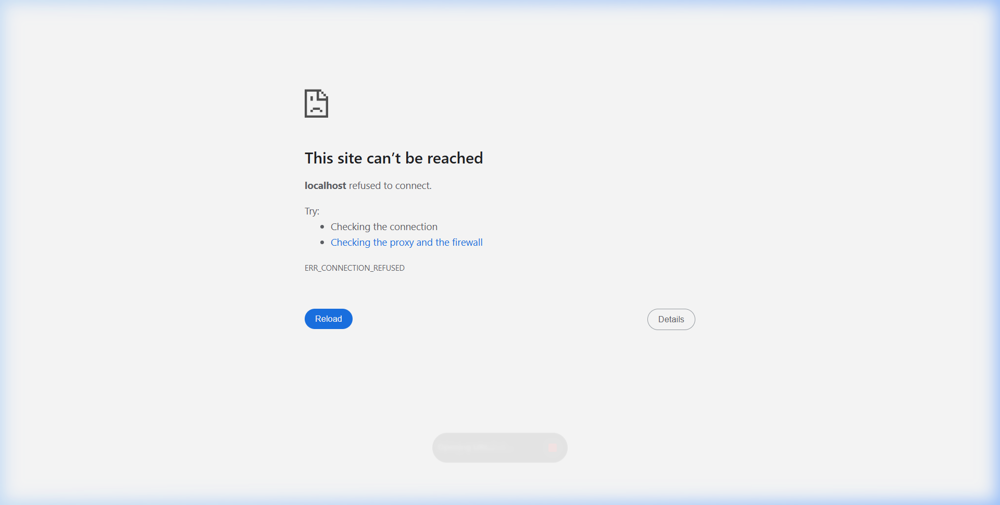

---

### Secure Login Portal
> Investigators authenticate with a Credential ID and secure passphrase. All sessions are JWT-secured.

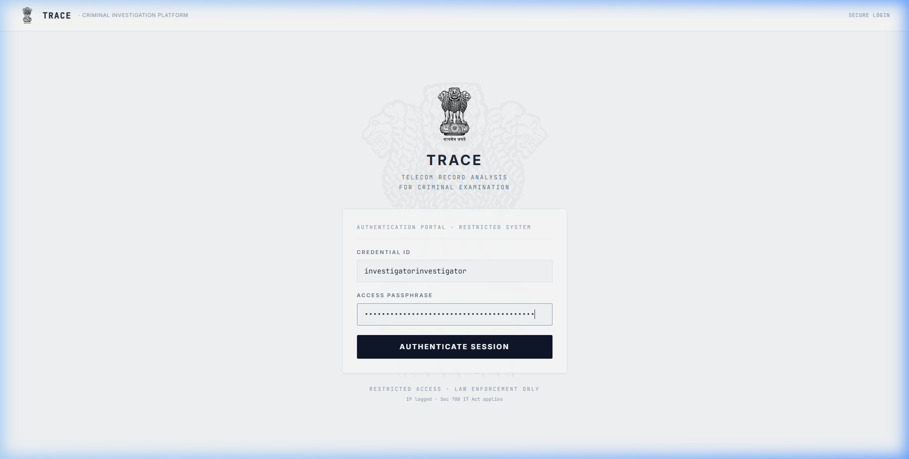

---

### Case Management Dashboard
> Create and manage investigation cases. View suspect counts and active alerts per case at a glance.

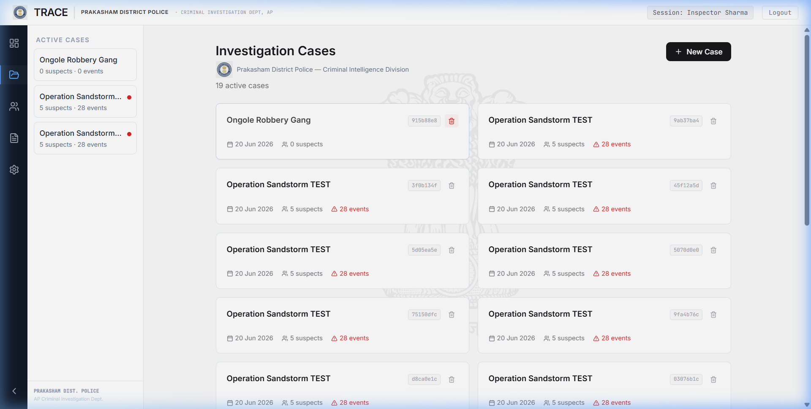

---

### Case Detail View
> The main investigation workspace. Tabs for suspects, co-location events, shared contacts, and network graph.

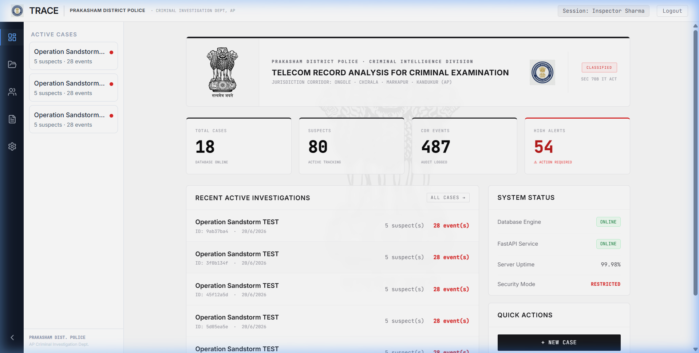

---

### Geospatial Cell Tower Map
> Every CDR record plotted on an interactive MapLibre map. Trace suspect movement and spot meetings visually. Supports standard vectors and Esri Satellite views.

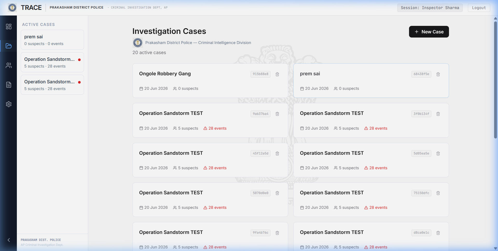

---

### Interactive Criminal Network Graph
> Force-directed graph of suspects and their contacts using ReactFlow. Red nodes represent high-risk handlers, and dashed nodes represent common contacts.

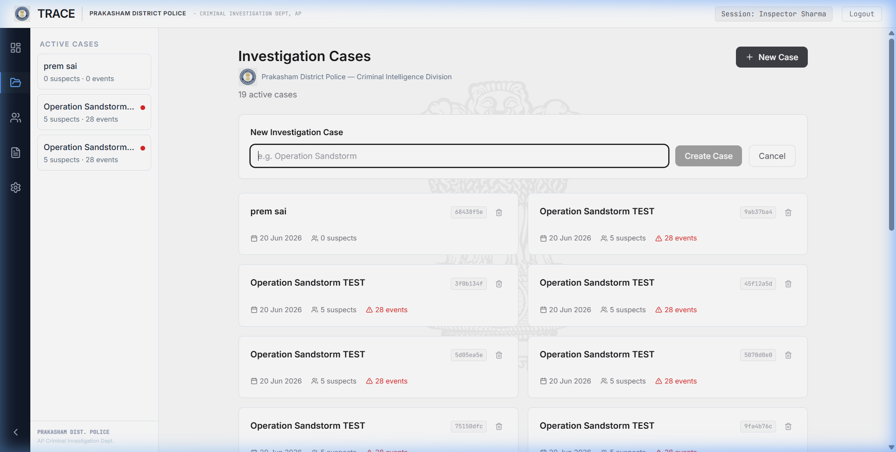

---

### Fullscreen Network Graph Workspace
> Native HTML5 fullscreen mode for the network graph. Perfect for large-screen cyber labs, keeping all search, filter, legend, and detail controls fully interactive and z-indexed.

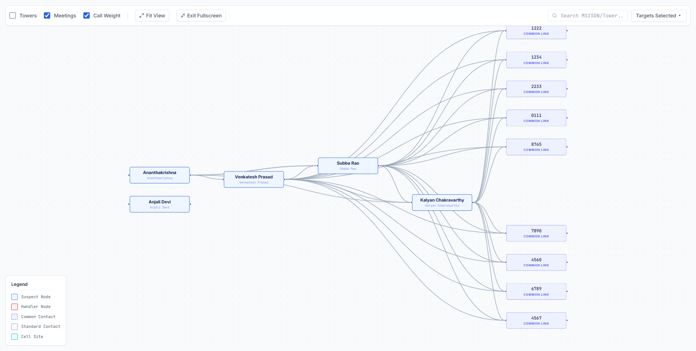

---

### Suspect Deep-Dive Profile
> Comprehensive suspect profile: 7×24 hourly activity heatmap, IMEI swap alerts, OTT application usage session breakdown, and court-ready PDF download.

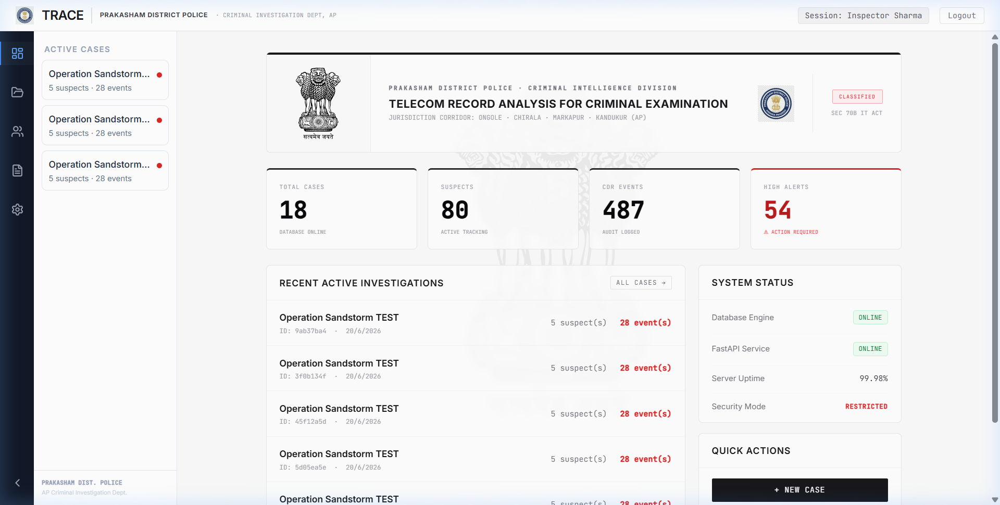

---

### Court-Ready PDF Forensic Report (Unique Feature)
> Automatically generated multi-page, court-grade investigation briefs. Contains all ingested CDR/IPDR metrics, maps, timeline analyses, and an auto-populated Section 65B Certificate of authenticity under the Indian Evidence Act, 1872. Features professional, eye-catching signature cards with bounding boxes for the Investigating Officer, Supervisory Officer, and Court Submission Officer to ensure judicial compliance.

📂 **[Download & View Real Sample Forensic Report PDF](docs/sample_court_report.pdf)**

*Note: GitHub automatically provides a full-featured, interactive PDF preview viewer when you click the PDF link above!*

---

### API Documentation (Swagger UI)
> Every analytical capability and database transaction exposed as a documented REST endpoint.

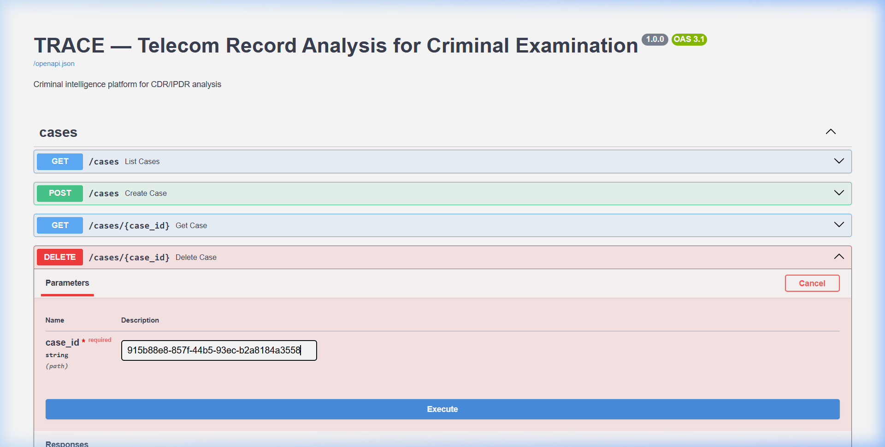

---

## System Architecture

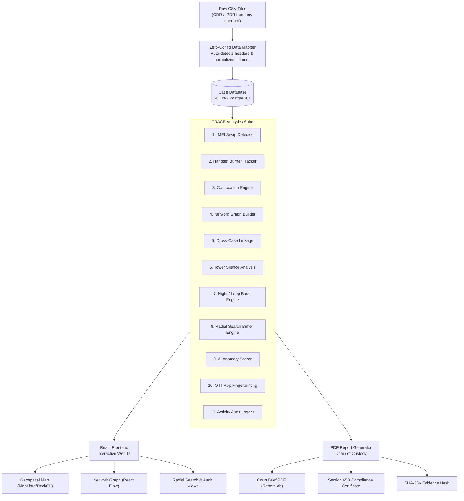

---

## How the Analytics Works

### 1. IMEI Swap & Burner Handset Detection

Every CDR row has a phone number (MSISDN) and a handset ID (IMEI). 
* **IMEI Swap:** TRACE sorts records by time per MSISDN and flags any row where the IMEI changes, capturing when and where device evasion took place.
* **Burner Handset:** The system scans all records globally and flags when a single IMEI appears with multiple distinct phone numbers — a key signature of burner/shared handsets.

---

### 2. Co-Location & Radial Buffer Searching

* **Co-Location:** TRACE compares suspect CDRs to identify when multiple suspects were registered at the same cell tower within a tight time window (e.g. 30 minutes), flagging physical meetings.
* **Radial Buffer Search:** Investigators can input a crime scene's coordinate (lat/lon) and a radius (in km), and the system uses the Haversine formula to return all suspects registered within that buffer zone.

---

### 3. Loop-Call & Night Burst Aggregation

TRACE aggregates call frequencies to flag network coordination:
* **Night-Call Burst:** Flags suspects making 5+ calls between 23:00 and 05:00 on a single day.
* **Loop-Call:** Flags rapid call cycles where the same A→B pair calls each other 3+ times within 30 minutes (urgent communication patterns).

---

### 4. Cross-Case Global Handler Matching

Compares contacts globally across *all* active cases in the database. If a non-suspect contact number appears in the logs of suspects in two or more distinct cases, it is flagged as a high-risk global coordinator/handler.

---

### 5. Tower Switch-Off & Silence Tracking

Flags when a suspect's phone goes completely dark (no CDR pings) for a period exceeding 6 hours. It isolates the exact time and cell tower coordinates of the last ping before switch-off and the first ping when re-established.

---

### 6. Explainable AI Anomaly Scoring

Each suspect receives a 0–100 risk score based on weighted behavioural signals:

| Signal | Metric Checked |
|:-------|:----------------|
| Night Calls Ratio | Percentage of nocturnal communication |
| Tower Silence Gaps | Number of switch-off windows |
| IMEI Swap Count | Handset evasion cycles |
| Co-Locations | Physical meetings with other suspects |
| OTT App Usage | Volume spikes on encrypted services |

**Risk Bands:**

| Score | Level | Recommended Action |
|:------|:------|:-------------------|
| 0 – 30 | Low | Routine monitoring |
| 31 – 60 | Medium | Elevated investigation |
| 61 – 80 | High | Priority surveillance |
| 81 – 100 | Critical | Immediate escalation |

---

## Technology Stack

### Backend
| Technology | Role |
|:-----------|:-----|
| **FastAPI** (Python 3.11) | REST API framework |
| **SQLAlchemy** + SQLite / PostgreSQL | Database ORM and storage |
| **pandas** | CSV ingestion and column mapping |
| **NetworkX** | Suspect graph construction |
| **scikit-learn** (IsolationForest) | AI anomaly scoring |
| **ReportLab** | Court-ready PDF generation |
| **JWT** | Investigator authentication |

### Frontend
| Technology | Role |
|:-----------|:-----|
| **React 18** + TypeScript | Web application framework |
| **Vite** | Fast build and dev server |
| **Tailwind CSS** | UI styling |
| **MapLibre GL** + **DeckGL** | High-performance interactive geospatial maps |
| **React Flow** | Suspect network graph |
| **Recharts** | Heatmaps and call charts |

### Infrastructure
| Technology | Role |
|:-----------|:-----|
| **Docker Compose** | One-command deployment |
| **Uvicorn** | ASGI server for FastAPI |
| **Swagger UI** | Auto-generated API docs |
---

## Deployment & Demo Mode

### Firebase Hosting
The frontend is compiled for production and deployed to Firebase Hosting:
* **Production URL:** [https://trace-prakasham.web.app](https://trace-prakasham.web.app)
* **Configuration:** Configured as a Single Page Application (SPA) routing all paths to `/index.html` via `firebase.json` settings.

### In-Browser Demo Mode Fallback
To enable instant testing without requiring a running Python FastAPI backend on your machine, the application features an automatic serverless fallback:
1. **Auto-Detection:** The API client probes `http://127.0.0.1:8000/health`. If it fails to connect, it gracefully flags the session to run in **offline/local mock mode**.
2. **Snapshot Ingestion:** All cases, maps, phone relationships, IMEI changes, and call heatmaps are populated from a static SQLite snapshot stored in [mockData.ts](file:///c:/Users/Acer/Downloads/prakasam%20police/trace-frontend/src/lib/mockData.ts).
3. **Simulated State:** You can create cases, upload records, and delete suspects in-memory. The application updates state dynamically in your browser session.
4. **Mock PDF Reports:** Pressing the report download button generates a mock PDF preview entirely within the browser via a base64 document stream.

---

## Quick Start

### Option A — Docker (Recommended)

```bash
git clone https://github.com/hydra-eng/trace.git
cd trace
docker-compose up --build
```

- Frontend: [http://localhost:5173](http://localhost:5173)
- API Docs: [http://localhost:8000/docs](http://localhost:8000/docs)

---

### Option B — Manual Setup

**Backend:**
```bash
cd trace-backend
pip install -r requirements.txt
python -m uvicorn main:app --reload --port 8000
```

**Frontend:**
```bash
cd trace-frontend
npm install
npm run dev
```

**Default Login Credentials:**
```
Credential ID : investigator
Access Passphrase : PrakasamPolice_2026!
```

---

## Demo Walkthrough & Seed Scenarios (5 Minutes)

We provide preloaded case records based in **Prakasham District, Andhra Pradesh** and the **AP/Telangana corridor**.

### Case 1: Ongole Tobacco Smuggling Syndicate (FIR 124/2026)
* **Narrative:** Smuggling group operating across Ongole, Chirala, Markapur, and Kandukur.
* **Suspect Files (located in `demo-data/`):**
  * Kalyan Chakravarthy (Kingpin): `Case1_Ongole_Tobacco_Smuggling_CDR_Kalyan_Chakravarthy.csv` and `Case1_Ongole_Tobacco_Smuggling_IPDR_Kalyan_Chakravarthy.csv`
  * Venkatesh Prasad (Coordinator): `Case1_Ongole_Tobacco_Smuggling_CDR_Venkatesh_Prasad.csv` and `Case1_Ongole_Tobacco_Smuggling_IPDR_Venkatesh_Prasad.csv`
  * Subba Rao (Local dealer): `Case1_Ongole_Tobacco_Smuggling_CDR_Subba_Rao.csv`
  * Ananthakrishna (Associate): `Case1_Ongole_Tobacco_Smuggling_CDR_Ananthakrishna.csv`
  * Anjali Devi (Control subject): `Case1_Ongole_Tobacco_Smuggling_CDR_Anjali_Devi.csv`

### Step-by-Step Walkthrough

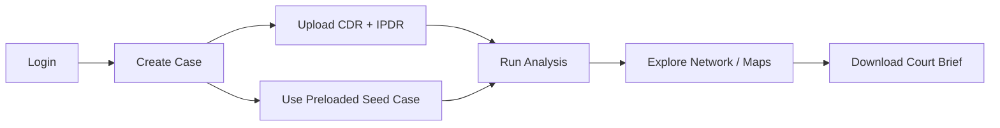

1. **Login:** Enter `investigator` and `PrakasamPolice_2026!` at the secure gateway.
2. **Select Case:** Select the seeded `Operation Sandstorm TEST` case or click **New Case** to create one.
3. **Upload Records:** Click **Upload Records** and upload the CDR and IPDR CSV files from `demo-data/` for Kalyan Chakravarthy and his associates.
4. **Run Analysis:** Click **Run Analysis**. TRACE normalizes and parses the CSV data in seconds.
5. **Inspect Findings:**
   - **Network Graph** -> Open **Network Graph** and toggle **Fullscreen**. Observe the red Node `919888000111` (common handler Venkata Ramana) connecting the suspects.
   - **Suspect Profile** -> Click Kalyan Chakravarthy. Observe the IMEI swap flagged on June 3rd, the co-location at Chirala Prakasham tower (`TWR-CDD-001`) with Subba Rao and Venkatesh, and WhatsApp/Telegram usage sessions parsed from IPDR.
6. **Download Report:** Click **Download Report** to export the court-ready PDF containing the SHA-256 hash validation header.

---

## API Reference

Full docs available at [http://localhost:8000/docs](http://localhost:8000/docs)

| Method | Endpoint | Description |
|:-------|:---------|:------------|
| `GET` | `/cases` | List all cases |
| `POST` | `/cases` | Create a new case |
| `POST` | `/upload/cdr` | Ingest CDR records |
| `POST` | `/upload/ipdr` | Ingest IPDR records |
| `POST` | `/analysis/run/{case_id}` | Execute 5-layer analysis |
| `GET` | `/suspects/{suspect_id}/profile` | Retrieve suspect profile, heatmap, and movement |
| `GET` | `/cases/{case_id}/network` | Retrieve ReactFlow graph structure |
| `GET` | `/report/pdf/{suspect_id}` | Export Section 65B IE Act PDF Brief |

---

## Security & Compliance

> **RESTRICTED — FOR AUTHORIZED LAW ENFORCEMENT USE ONLY**

- PDF reports include a **SHA-256 hash** of uploaded source files — establishes Chain of Custody compliant with **Section 65B of the Indian Evidence Act**
- All sessions secured via **JWT tokens** with configurable expiry
- TRACE runs **fully offline** — no data leaves the investigator's workstation
- All upload and analysis operations are logged with timestamps
